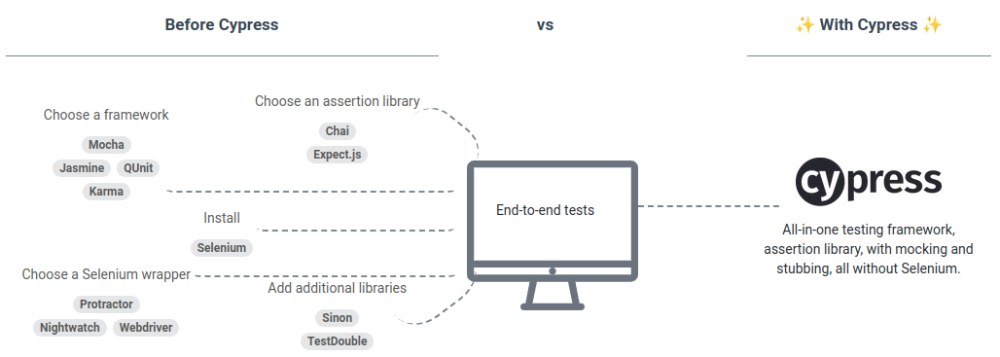

# Cypress Workshop E2E
----------------------------
### Acerca de este workshop
El objetivo de este workshop es enseñar lo básico para poder empezar a utilizar Cypress para pruebas end to end de aplicaciones web

### Contenido
[Requerimientos](#0)  
[¿Qué es Cypress?](#1)  
[Ventajas de Cypress](#2)  
[Desventajas de Cypress](#3)  
[Instalación](#4)  
[Scripts](#5)  
[Estructura de un Test](#6)  
[Estructura del Proyecto](#7)  
[Localizando elementos web](#8)  
[Interactuando con elementos web](#9)   
[Validando elementos web](#10)  
[Command personalizados y utilidades](#11)   
[Usando Peticiones HTTP](#12)  

### Requerimientos <a id="0"></a>
-Conocimientos Básicos de Javascript
-Node.js - https://nodejs.org/en/download/  

### ¿Qué es Cypress? <a id="1"></a>
Cypress se define cómo una herramienta de prueba de front-end para la web moderna. Fue creada por Devs para Devs. 
Busca solucionar problemas que enfrentan los desarrolladores al probar aplicaciones modernas con herramientas como Selenium, haciendo foco por ejemplo en una instalación sencilla y sin problemas de tiempo de espera.



*Más info:*  
Cómo funciona - https://www.cypress.io/how-it-works  
Por qué Cypress - https://docs.cypress.io/guides/overview/why-cypress  

### Ventajas de Cypress <a id="2"></a>
 - Fácil instalación y configuración
 - Hot Reload (Las pruebas se ejecutan solas al guardar el archivo)
 - Gran cantidad de plugins hechos por la comunidad
 - Tiempo de esperas automático
 - Documentación completa con muchos ejemplos

### Desventajas de Cypress <a id="3"></a>
 - No permite automatizar cambio de pestañas y dominios
 - Sólo compatible con Javascript/Typescript
 - No se puede abrir dos navegadores al mismo tiempo

### Instalación del Proyecto <a id="4"></a>
Una vez clonado el repositorio, podemos instalar Cypress utilizando el Node Package Manager
```
npm install --save-dev
```
Una vez instalado podemos revisar versión cypress para confirmar que la instalación se realizo correctamente:  
```
npx cypress --version
```
### Scripts <a id="5"></a>
En el archivo *package.json* se encuentran los diferentes scripts disponibles:   
**cy:open**: Para abrir la interfaz de Cypress   
**cy:run**: Ejecutar las todas las pruebas en modo *headless*   
**cy:run:hello-world**: Ejecutar las todas las pruebas en modo *headless* de *hello-world.cy.js*  
**cy:run:locators**: Ejecutar las todas las pruebas en modo *headless* de *locators.cy.js*  
**cy:run:interactions**: Ejecutar las todas las pruebas en modo *headless* de *interactions.cy.js*  
**cy:run:assertions**: Ejecutar las todas las pruebas en modo *headless* de *assertions.cy.js*  
**cy:run:request**: Ejecutar las todas las pruebas en modo *headless* de *request.cy.js*  
**cy:run:utils**: Ejecutar las todas las pruebas en modo *headless* de *utils.cy.js*  

Cada script se puede ejecutar usando el Node Package Manager:
```
npm run <nombre del script>
```
Por ejemplo:
```
npm run <nombre del script>
```

### Estructura de Tests <a id="6"></a>
Ver archivo *1-hello-world.cy.js*

*Más info*:  
Escribiendo pruebas  - https://docs.cypress.io/guides/end-to-end-testing/writing-your-first-end-to-end-test  

### Estructura del Proyecto <a id="7"></a>
**cypress.json**: Toda la configuración de Cypress
**cypress/e2e**: Archivos de pruebas (archivos con extensión .cy.js) 
**cypress/fixtures**: Datos de pruebas (archivos con extensión .json)
**cypress/support**: Commandos compartidos , Utilidades

*Más info:*  
Organizando las pruebas: https://docs.cypress.io/guides/core-concepts/writing-and-organizing-tests  

### Localizando elementos web <a id="8"></a>
Ver archivo *2-locators.cy.js*

*Más info:*  
Command Get     - https://docs.cypress.io/api/commands/get  
Command Contains- https://docs.cypress.io/api/commands/contains  
Command Find    - https://docs.cypress.io/api/commands/find  
Command Within  - https://docs.cypress.io/api/commands/within  

### Interactuando con elementos web <a id="9"></a>
Ver archivo *3-interactions.cy.js*

*Más info:*:  
Command Click   - https://docs.cypress.io/api/commands/click  
Command Hover   - https://docs.cypress.io/api/commands/hover  
Command Check   - https://docs.cypress.io/api/commands/check  
Command Select  - https://docs.cypress.io/api/commands/select  

### Validando de elementos web <a id="10"></a>
Ver archivo *4-assertions.cy.js* 

*Más info:*  
Assertions - https://docs.cypress.io/guides/references/assertions  
 
### Commands personalizados y Utilidades <a id="11"></a>
Ver archivo *5-utils.cy.js*  

*Más info:*   
Custom Commands - https://docs.cypress.io/api/cypress-api/custom-commands   
Cookies - https://docs.cypress.io/api/cypress-api/cookies  
Command Fixture - https://docs.cypress.io/api/commands/fixture  
Command Invoke  - https://docs.cypress.io/api/commands/invoke  

### Usando Peticiones HTTP <a id="12"></a>
Ver archivo *6-request.cy.js* 

*Más info:*  
Network Request - https://docs.cypress.io/guides/guides/network-requests  

### Facilitadores
Alejando Lartigue   
### Documentación Oficial de Cypress
https://docs.cypress.io/


